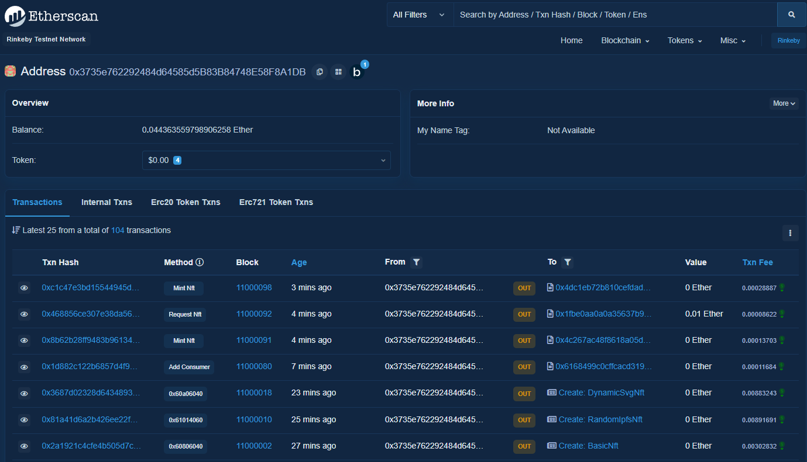
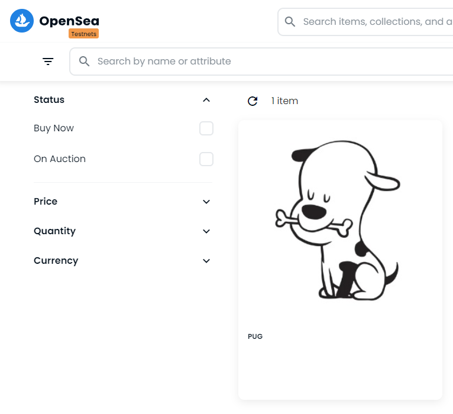
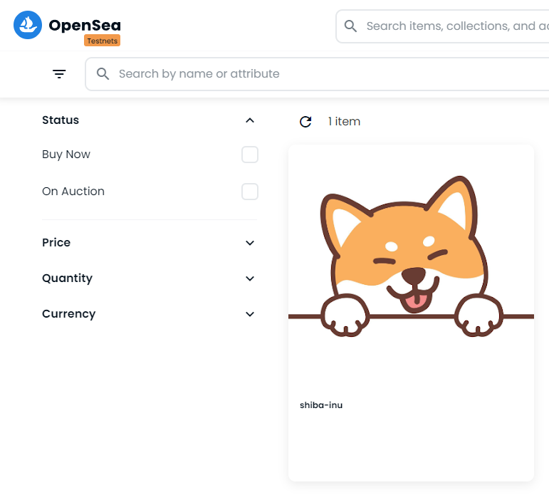
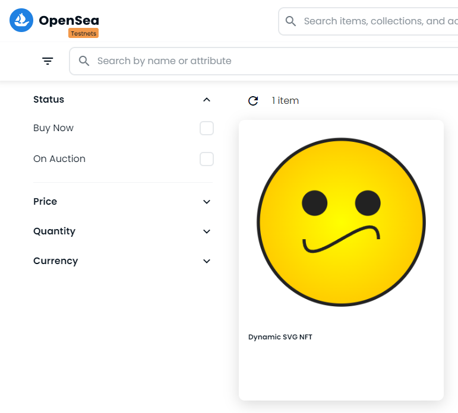

## Getting Started

### Prerequisites

```shell
npm i npm@latest -g
npm init -y
```

### Installation

```shell
npm i -D hardhat
npx hardhat
```

√ Create an advanced sample project that uses TypeScript
Hardhat project root: » C:\Projects\solidity-patrick-nft
Do you want to add a .gitignore? (Y/n) » y

You need to install these dependencies to run the sample project:
```shell
npm install --save-dev "hardhat@^2.9.9" "@nomiclabs/hardhat-waffle@^2.0.0" "ethereum-waffle@^3.0.0" "chai@^4.2.0" "@nomiclabs/hardhat-ethers@^2.0.0" "ethers@^5.0.0" "@nomiclabs/hardhat-etherscan@^3.0.0" "dotenv@^16.0.0" "eslint@^7.29.0" "eslint-config-prettier@^8.3.0" "eslint-config-standard@^16.0.3" "eslint-plugin-import@^2.23.4" "eslint-plugin-node@^11.1.0" "eslint-plugin-prettier@^3.4.0" "eslint-plugin-promise@^5.1.0" "hardhat-gas-reporter@^1.0.4" "prettier@^2.3.2" "prettier-plugin-solidity@^1.0.0-beta.13" "solhint@^3.3.6" "solidity-coverage@^0.7.16" "@typechain/ethers-v5@^7.0.1" "@typechain/hardhat@^2.3.0" "@typescript-eslint/eslint-plugin@^4.29.1" "@typescript-eslint/parser@^4.29.1" "@types/chai@^4.2.21" "@types/node@^12.0.0" "@types/mocha@^9.0.0" "ts-node@^10.1.0" "typechain@^5.1.2" "typescript@^4.5.2"
```

```shell
npm i -D hardhat-deploy
npm i -D @nomiclabs/hardhat-ethers@npm:hardhat-deploy-ethers ethers
```
```shell
npm i -D @openzeppelin/contracts
npm i -D @chainlink/contracts

npm i -D @pinata/sdk
npm i -D base64-sol
```

## Resources

Lesson 14 of the FreeCodeCamp Solidity & Javascript Blockchain Course
* https://github.com/PatrickAlphaC/hardhat-nft-fcc

EIP-721: Non-Fungible Token Standard
* https://eips.ethereum.org/EIPS/eip-721

OpenZeppelin Contracts
* https://docs.openzeppelin.com/contracts/4.x/
* https://docs.openzeppelin.com/contracts/4.x/erc721
* https://docs.openzeppelin.com/contracts/4.x/access-control

VRF (Chainlink Verifiable Randomness Function)
* https://vrf.chain.link/

Pinata
* https://app.pinata.cloud/pinmanager
* https://www.npmjs.com/package/@pinata/sdk

🟡 smartcontractkit/chainlink
* https://github.com/smartcontractkit/chainlink/blob/develop/contracts/src/v0.8/tests/MockV3Aggregator.sol


# Usage

## Useful commands

```shell
# Delete folder artefacts and clear folder cash
hh clean

# Compile files in ./contracts
hh compile

# Run tests
hh test

# Code coverage for Solidity tests
hh coverage
```

## Result
### Deploy and mint to localhost
```shell
$ hh deploy
Nothing to compile
No need to generate any newer typings.

Local network detected! Deploying mocks...
deploying "VRFCoordinatorV2Mock" (tx: 0x11b9dfa83e5a81e783d8d818bd6499fa1504a937113eca5f07b8cfafe70751ea)...: deployed at 0x5FbDB2315678afecb367f032d93F642f64180aa3 with 1797707 gas
deploying "MockV3Aggregator" (tx: 0x107d82b9a5db8ebcb9facc8ffe2cc9d066ba47f948055ed3e17ea65c539e1f8f)...: deployed at 0xe7f1725E7734CE288F8367e1Bb143E90bb3F0512 with 697026 gas
Mocks Deployed!
------------------------------------------------
deploying "BasicNft" (tx: 0x2bcc558845881b184d044de27e541ebfc6f6cf6298ebe7661d6db5ddcde8e07a)...: deployed at 0x9fE46736679d2D9a65F0992F2272dE9f3c7fa6e0 with 2018881 gas
BasicNft Deployed!
------------------------------------------------
deploying "RandomIpfsNft" (tx: 0xd1aa814a4ed6b1740967337fec6fb49a12fdc86720c09d8926cb4e881f736a75)...: deployed at 0x5FC8d32690cc91D4c39d9d3abcBD16989F875707 with 3566754 gas
RandomIpfsNft Deployed!
------------------------------------------------
deploying "DynamicSvgNft" (tx: 0x522e57c68b84c376473b754db8ec940a51d3f729e9a6bbb0130da9a643f20af7)...: deployed at 0x0165878A594ca255338adfa4d48449f69242Eb8F with 4416216 gas
DynamicSvgNft Deployed!
------------------------------------------------

Minting NFT...

Basic NFT index 0 has token URI:  ipfs://QmbWTbeWvcgRSYCVt8kKETnbo3sG2WTN1iaWHRF6fpZuFw?filename=dogie.json

Random IPFS NFT index 0 has token URI:  ipfs://QmXeDv1ymVRPgH4CDUmU5TeffVG9UHi394YR7EqUCaY9gJ

Dynamic SVG NFT index 0 has token URI:  data:application/json;base64,eyJuYW1lIjoiRHluYW1pYyBTVkcgTkZUIiwgImRlc2NyaXB0aW9uIjoiQW4gTkZUIHRoYXQgY2hhbmdlcyBiYXNlZCBvbiB0aGUgQ2hhaW5saW5rIEZlZW
QiLCAiYXR0cmlidXRlcyI6IFt7InRyYWl0X3R5cGUiOiAiY29vbG5lc3MiLCAidmFsdWUiOiAxMDB9XSwgImltYWdlIjoiZGF0YTppbWFnZS9zdmcreG1sO2Jhc2U2NCxQSE4yWnlCMmFXVjNRbTk0UFNJd0lEQWdNakF3SURJd01DSWdkMmxrZEdnO
UlqUXdNQ0lnSUdobGFXZG9kRDBpTkRBd0lpQjRiV3h1Y3owaWFIUjBjRG92TDNkM2R5NTNNeTV2Y21jdk1qQXdNQzl6ZG1jaVBnb2dJQ0FnUEdSbFpuTStDaUFnSUNBZ0lDQWdQSEpoWkdsaGJFZHlZV1JwWlc1MElHbGtQU0puY21Ga01TSWdZM2c5
SWpVd0pTSWdZM2s5SWpVd0pTSWdjajBpTlRBbElpQm1lRDBpTlRBbElpQm1lVDBpTlRBbElqNEtJQ0FnSUNBZ0lDQWdJQ0FnUEhOMGIzQWdiMlptYzJWMFBTSXdKU0lnYzNSNWJHVTlJbk4wYjNBdFkyOXNiM0k2STBaR01DSWdMejRLSUNBZ0lDQWd
JQ0FnSUNBZ1BITjBiM0FnYjJabWMyVjBQU0l4TURBbElpQnpkSGxzWlQwaWMzUnZjQzFqYjJ4dmNqb2pSa013SWlBdlBnb2dJQ0FnSUNBZ0lEd3ZjbUZrYVdGc1IzSmhaR2xsYm5RK0NpQWdJQ0E4TDJSbFpuTStDaUFnSUNBOFkybHlZMnhsSUdONF
BTSXhNREFpSUdONVBTSXhNREFpSUdacGJHdzlJblZ5YkNnalozSmhaREVwSWlCeVBTSTNPQ0lnYzNSeWIydGxQU0lqTWpJeUlpQnpkSEp2YTJVdGQybGtkR2c5SWpNaUx6NEtJQ0FnSUR4bklHTnNZWE56UFNKbGVXVnpJaUJtYVd4c1BTSWpNakl5S
Wo0S0lDQWdJQ0FnSUNBOFkybHlZMnhsSUdONFBTSTNOU0lnWTNrOUlqZ3lJaUJ5UFNJeE1pSXZQZ29nSUNBZ0lDQWdJRHhqYVhKamJHVWdZM2c5SWpFeU5TSWdZM2s5SWpneUlpQnlQU0l4TWlJdlBnb2dJQ0FnUEM5blBnb2dJQ0FnUEhCaGRHZ2da
RDBpYlRZMUlERXhOaUJqTUNBME1DQTNNQ0F0TkRBZ056QWdNQ0lnWm1sc2JEMGlibTl1WlNJZ2MzUnliMnRsUFNJak1qSXlJaUJ6ZEhKdmEyVXRkMmxrZEdnOUlqTWlMejRLUEM5emRtYytDZz09In0=
------------------------------------------------
```

### Deploy to Rinkeby
```shell
$ hh deploy --tags main --network rinkeby
Nothing to compile
No need to generate any newer typings.
deploying "BasicNft" (tx: 0x595c7d15746d0f29d2f7e53d45bfbada07b3db3fe0890381c35a1a4c76a74556)...: deployed at 0xC89FD7D0C69492b80AD4f372207bBE208883d015 with 2014553 gas
BasicNft Deployed!
Verifying...
Verifying...
Nothing to compile
No need to generate any newer typings.
Successfully submitted source code for contract
contracts/BasicNft.sol:BasicNft at 0xC89FD7D0C69492b80AD4f372207bBE208883d015
for verification on the block explorer. Waiting for verification result...

Successfully verified contract BasicNft on Etherscan.
https://rinkeby.etherscan.io/address/0xC89FD7D0C69492b80AD4f372207bBE208883d015#code
------------------------------------------------
deploying "RandomIpfsNft" (tx: 0x81a41d6a2b426ee22f0f9d13606dccf9a7cb746de5dd484f7892cf21bb6191c4)...: deployed at 0x1FBE0Aa0A0a35637B941A945a6208F1a8f3786d5 with 3566766 gas
RandomIpfsNft Deployed!
Verifying...
Verifying...
Generating typings for: 24 artifacts in dir: typechain for target: ethers-v5
Successfully generated 41 typings!
Compiled 25 Solidity files successfully
Successfully submitted source code for contract
contracts/RandomIpfsNft.sol:RandomIpfsNft at 0x1FBE0Aa0A0a35637B941A945a6208F1a8f3786d5
for verification on the block explorer. Waiting for verification result...

Successfully verified contract RandomIpfsNft on Etherscan.
https://rinkeby.etherscan.io/address/0x1FBE0Aa0A0a35637B941A945a6208F1a8f3786d5#code
------------------------------------------------
deploying "DynamicSvgNft" (tx: 0x3687d02328d6434893bbd24b0b0d47c80cece412febf2124e5c8da404f939cbf)...: deployed at 0x4DC1eb72b810CEfDaD3Da60Fd59E5dae23006a82 with 4416216 gas
DynamicSvgNft Deployed!
Verifying...
Verifying...
Nothing to compile
No need to generate any newer typings.
Successfully submitted source code for contract
contracts/DynamicSvgNft.sol:DynamicSvgNft at 0x4DC1eb72b810CEfDaD3Da60Fd59E5dae23006a82
for verification on the block explorer. Waiting for verification result...

Successfully verified contract DynamicSvgNft on Etherscan.
https://rinkeby.etherscan.io/address/0x4DC1eb72b810CEfDaD3Da60Fd59E5dae23006a82#code
------------------------------------------------
```
## Mint to Rinkeby
```shell
$ hh deploy --tags mintNft --network rinkeby
Nothing to compile
No need to generate any newer typings.

Minting NFT...

Basic NFT index 0 has token URI:  ipfs://QmfSWzZr4ftLoqCdyWbyZicF4vgW1L18JFbeieXdHw7Fuu

Random IPFS NFT index 0 has token URI:  ipfs://QmeZmZ1EJHNVdqE6JHA31g1vyFjyusqU95o7erKattPYjR

Dynamic SVG NFT index 0 has token URI:  data:application/json;base64,eyJuYW1lIjoiRHluYW1pYyBTVkcgTkZUIiwgImRlc2NyaXB0aW9uIjoiQW4gTkZUIHRoYXQgY2hhbmdlcyBiYXNlZCBvbiB0aGUgQ2hhaW5saW5rIEZlZW
QiLCAiYXR0cmlidXRlcyI6IFt7InRyYWl0X3R5cGUiOiAiY29vbG5lc3MiLCAidmFsdWUiOiAxMDB9XSwgImltYWdlIjoiZGF0YTppbWFnZS9zdmcreG1sO2Jhc2U2NCxQSE4yWnlCMmFXVjNRbTk0UFNJd0lEQWdNakF3SURJd01DSWdkMmxrZEdnO
UlqUXdNQ0lnSUdobGFXZG9kRDBpTkRBd0lpQjRiV3h1Y3owaWFIUjBjRG92TDNkM2R5NTNNeTV2Y21jdk1qQXdNQzl6ZG1jaVBnb2dJQ0FnUEdSbFpuTStDaUFnSUNBZ0lDQWdQSEpoWkdsaGJFZHlZV1JwWlc1MElHbGtQU0puY21Ga01TSWdZM2c5
SWpVd0pTSWdZM2s5SWpVd0pTSWdjajBpTlRBbElpQm1lRDBpTlRBbElpQm1lVDBpTlRBbElqNEtJQ0FnSUNBZ0lDQWdJQ0FnUEhOMGIzQWdiMlptYzJWMFBTSXdKU0lnYzNSNWJHVTlJbk4wYjNBdFkyOXNiM0k2STBaR01DSWdMejRLSUNBZ0lDQWd
JQ0FnSUNBZ1BITjBiM0FnYjJabWMyVjBQU0l4TURBbElpQnpkSGxzWlQwaWMzUnZjQzFqYjJ4dmNqb2pSa013SWlBdlBnb2dJQ0FnSUNBZ0lEd3ZjbUZrYVdGc1IzSmhaR2xsYm5RK0NpQWdJQ0E4TDJSbFpuTStDaUFnSUNBOFkybHlZMnhsSUdONF
BTSXhNREFpSUdONVBTSXhNREFpSUdacGJHdzlJblZ5YkNnalozSmhaREVwSWlCeVBTSTNPQ0lnYzNSeWIydGxQU0lqTWpJeUlpQnpkSEp2YTJVdGQybGtkR2c5SWpNaUx6NEtJQ0FnSUR4bklHTnNZWE56UFNKbGVXVnpJaUJtYVd4c1BTSWpNakl5S
Wo0S0lDQWdJQ0FnSUNBOFkybHlZMnhsSUdONFBTSTNOU0lnWTNrOUlqZ3lJaUJ5UFNJeE1pSXZQZ29nSUNBZ0lDQWdJRHhqYVhKamJHVWdZM2c5SWpFeU5TSWdZM2s5SWpneUlpQnlQU0l4TWlJdlBnb2dJQ0FnUEM5blBnb2dJQ0FnUEhCaGRHZ2da
RDBpYlRZMUlERXhOaUJqTUNBME1DQTNNQ0F0TkRBZ056QWdNQ0lnWm1sc2JEMGlibTl1WlNJZ2MzUnliMnRsUFNJak1qSXlJaUJ6ZEhKdmEyVXRkMmxrZEdnOUlqTWlMejRLUEM5emRtYytDZz09In0=
------------------------------------------------
```
## Transactions of my wallet   
https://rinkeby.etherscan.io/address/0x3735e762292484d64585d5B83B84748E58F8A1DB    


## Minted NFT in testnets.opensea.io     
Search: 0xC89FD7D0C69492b80AD4f372207bBE208883d015   
Result: https://testnets.opensea.io/collection/dogie-zaejifdyl2   


Search: 0x1FBE0Aa0A0a35637B941A945a6208F1a8f3786d5   
https://testnets.opensea.io/collection/random-ipfs-nft-jbmftoahpp       


Search: 0x4DC1eb72b810CEfDaD3Da60Fd59E5dae23006a82   
https://testnets.opensea.io/collection/dynamic-svg-nft-8pfj4wvvfq       

